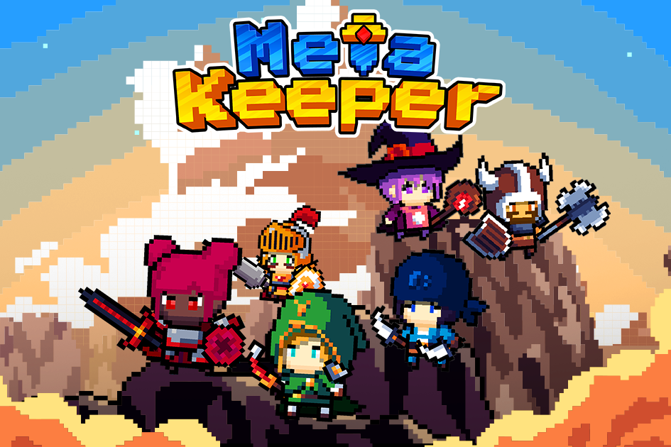

Metakeeper 是 BSC 区块链上 NFT 收藏品的游戏体验。玩赚取丰厚的奖励！
通过探索任务，与敌人战斗并收集 MKP 代币作为奖励。玩家与一群守门员合作击败未知敌人。每个守门员都有不同的统计数据，如果你幸运的话，你可能会招募到具有良好统计数据的守门员！通过升级，他们可以变得更加可靠并与您一起保护元世界！
守门员并不孤单。玩家可以招募伙伴来增加奖励或增加统计数据以帮助完成任务。每个饲养员、合作伙伴和小酒馆都是 NFT，增加了所有权和可追溯性！

