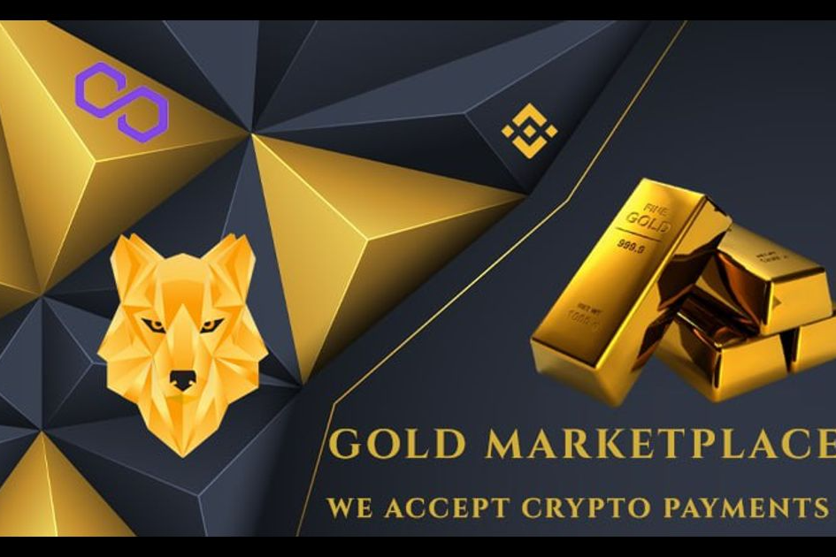

建立自己的资本和未来
币安智能链上的去中心化黄金市场
NFT MarketPlace BETA 启动
$MGLD 持有者通过与币安挂钩的 $EGLD 获得被动收入
每笔交易的 7% EGLD 奖励/活跃社区成员的 3% 实物和虚拟黄金，
CEX 已经上市，DxSale 锁定了 18 年的流动性，直到 2040 年。
转向采用加密货币，最近与珠宝制造商和供应商建立合作伙伴关系，将贵金属与加密联系起来。
规划的公用事业，如用于比特币挖矿和节点托管的绿色能源太阳能公园。
在那里，成为黄金！

