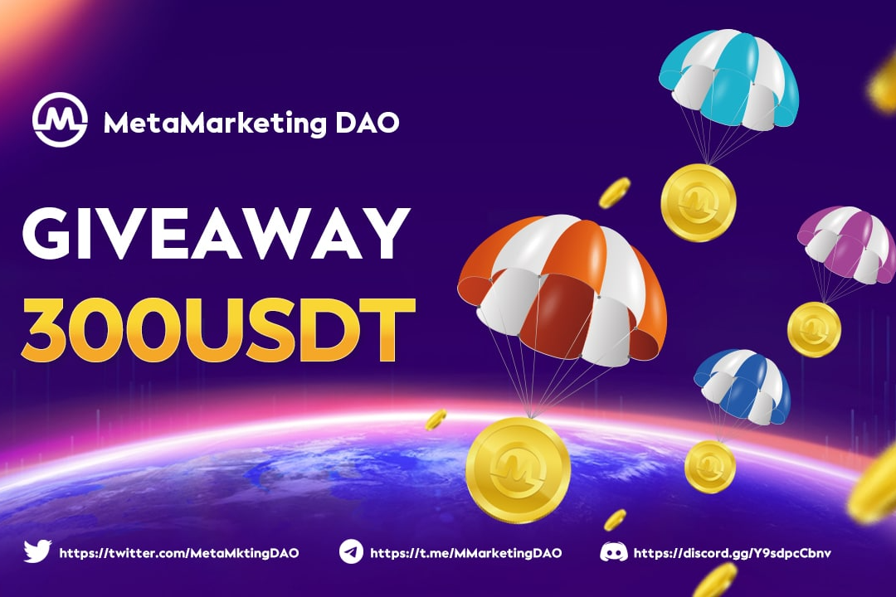

---
title: "MetaMarketing DAO"
description: "MetaMarketing DAO 是第一个 Web3 营销 DAO，为 Web3 项目提供营销包，同时为 DAO 成员提供高投资收益."
date: 2022-08-18T00:00:00+08:00
lastmod: 2022-08-18T00:00:00+08:00
draft: false
authors: ["boogArno"]
featuredImage: "metamarketing-dao.png"
tags: ["Social","MetaMarketing DAO"]
categories: ["nfts"]
nfts: ["Social"]
blockchain: "BSC"
website: "https://metamarketingdao.com/"
twitter: "https://twitter.com/MetaMktingDAO"
discord: "https://discord.gg/Y9sdpcCbnv"
telegram: "https://t.me/metamarketingdaoann"
github: ""
youtube: ""
twitch: ""
facebook: ""
instagram: ""
reddit: ""
medium: ""
steam: ""
gitbook: ""
googleplay: ""
appstore: ""
status: "Live"
weight: 
lightgallery: true
toc: true
pinned: false
recommend: false
recommend1: false
---
什么是元营销 DAO？我如何从 MetaMarketing DAO 中受益？
MetaMarketing 是一种研究营销及其与生活各个方面的关系的方法，它侧重于营销中的所有社会、道德、科学和商业经验，从而建立一个知识库，将各个方面的经验与人类相结合性格。
MetaMarketing DAO 是一个以营销为中心的去中心化自治组织，将项目与 KOL、社区和影响者进行匹配。它建立在去中心化区块链协议之上，允许项目或代币企业通过强大的社区和影响者在各种形式的营销平台（如 Twitter、Discord、Telegram、YouTube 等）的支持下寻求一流的加密营销。等等
我们的使命是提供 MaaS（营销即服务）DAO，让任何人——具有任何级别的加密知识——都能轻松访问市场上最具竞争力的项目和营销资源。
除了成为具有前瞻性和营销驱动的社区的一部分外，您还可以通过多种方式从 MetaMarketing DAO 中获得经济利益。社区质押者不仅可以在整个项目和营销决策中进行治理和投票，还可以分享项目奖励池的高额利润。

