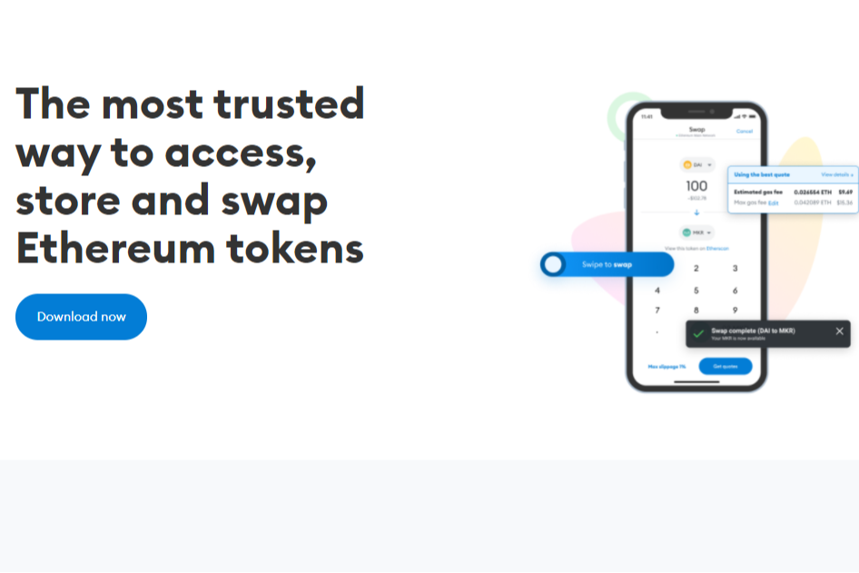

---
title: "MetaMask Swap"
description: "从钱包和网关到区块链应用程序的加密交换。受到全球超过 500 万用户的信赖."
date: 2022-08-18T00:00:00+08:00
lastmod: 2022-08-18T00:00:00+08:00
draft: false
authors: ["boogArno"]
featuredImage: "metamask-swap.png"
tags: ["DeFi","MetaMask Swap"]
categories: ["nfts"]
nfts: ["DeFi"]
blockchain: "ETH"
website: "https://metamask.io/"
twitter: "https://twitter.com/metamask?lang=en"
discord: ""
telegram: ""
github: ""
youtube: ""
twitch: ""
facebook: ""
instagram: ""
reddit: ""
medium: ""
steam: ""
gitbook: ""
googleplay: ""
appstore: ""
status: "Live"
weight: 
lightgallery: true
toc: true
pinned: false
recommend: false
recommend1: false
---
随时随地交换
直接从您的桌面或移动钱包交换代币。 Swaps 功能结合了来自去中心化交易所聚合器、做市商和 DEX 的数据，以确保您以最低的网络费用获得最优惠的价格。
与市面上的其他加密钱包不同，MetaMask 以隐私为先。我们授权您访问、存储和交换代币，而不必担心 dapp 或交易所会访问超出您同意提供的个人数据。无论您是参与去中心化金融，还是浏览 Web 3.0，使用 MetaMask，您始终可以完全控制您的数据。

