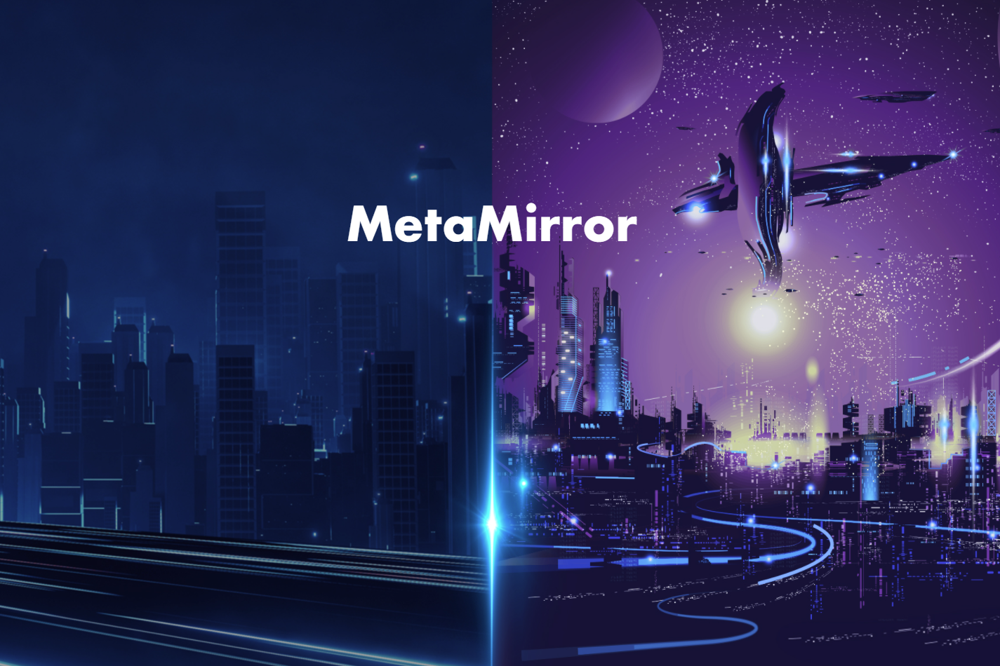

MBuddy：你在 Metaverse 中的镜像身份
MBuddy 是使用 MetaMirror 的核心——一个将您从人类世界连接到 Metaverse 的 Metaverse 身份基础设施。它也是您数据权利的捍卫者。
MBuddy 是从您的数据中诞生的数字生物。它管理您的数据资产并收集产生的收入。首席 MBuddy 将在常见问题解答部分解释这是如何工作的。

MBuddy 是使用 MetaMirror 的核心——一个将您从人类世界连接到 Metaverse 的 Metaverse 身份基础设施。它也是您数据权利的捍卫者。

MBuddy 是从您的数据中诞生的数字生物。它管理您的数据资产并收集产生的收入。首席 MBuddy 将在常见问题解答部分解释这是如何工作的。

