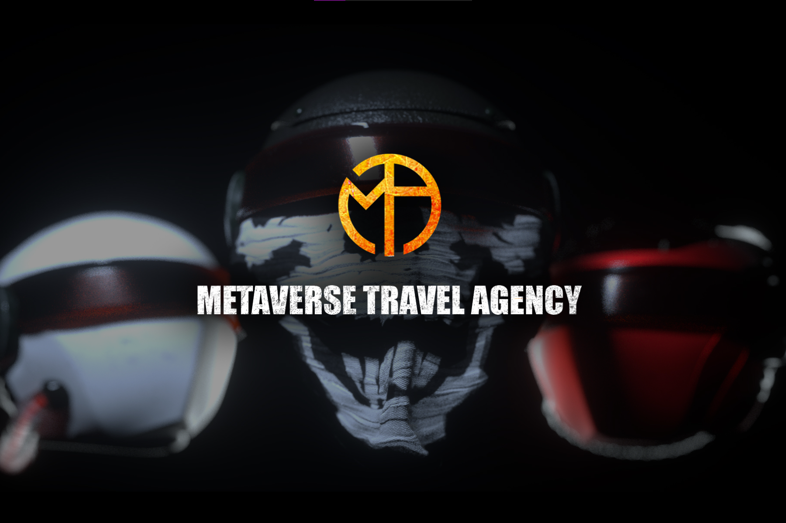

Metaverse Travel Agency (M.T.A.) 正在以太坊区块链上开创下一代可穿戴 NFT。我们的第一个系列包括 10,101 个随机组装的 Metahelmets。
每个 Metahelmet 都是独一无二的，但有些比其他的更罕见。铸造你的，加入一个致力于保护 Metaverse：The Metanauts 的蓬勃发展的探索者社区。

每个 Metahelmet 都是独一无二的，由 100 多种可能的特征随机组合而成。每个 NFT 都存储为 ERC-721 令牌，并托管在 IPFS 上。

要铸造 Metahelmet 并访问独家内容和会员专属福利，Metanauts 必须连接他们的 Metamask 钱包。

量子机器
每个 Metahelmet 都配备了一个屏幕，允许用户直接在 Helmet 上显示他们拥有的其他 NFT。通过访问 The Quantum Machine，可以在需要时合并和取消合并 NFT。 Metanauts 将在发布后不久使用此功能。

