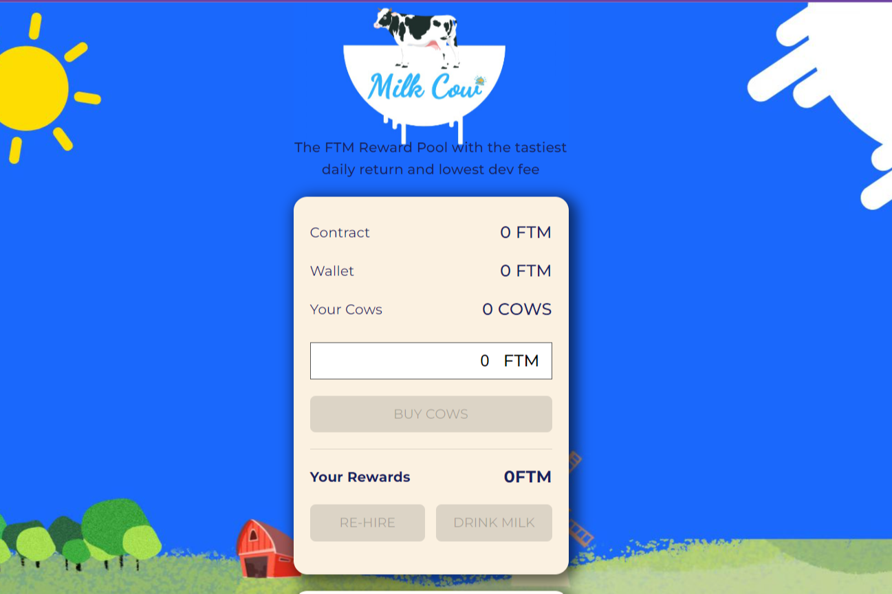

什么是奶牛？
Milk Cow 是 FTM 上的 BakedBeans 分支，具有创新性的调整。它为协议中的每笔 FTM 存款提供 8% 的每日回报。
随着奶牛的突然消失，人类的牛奶已经枯竭。每个人都不知道，这些奶牛被带到了一个秘密的空间用于农业目的。现在你已经发现了这个秘密维度，你有机会通过接触奶牛和牛奶变得更富有、更健康。
在这个现代农业项目中，您将能够将 FTM 存入 Milk Cow 以获得一定数量的奶牛。然后，您将能够用奶牛耕种和挤奶。为了让这个维度持续运转并让奶牛活着，我们需要越来越多有道德的农民。
来加入我们。

