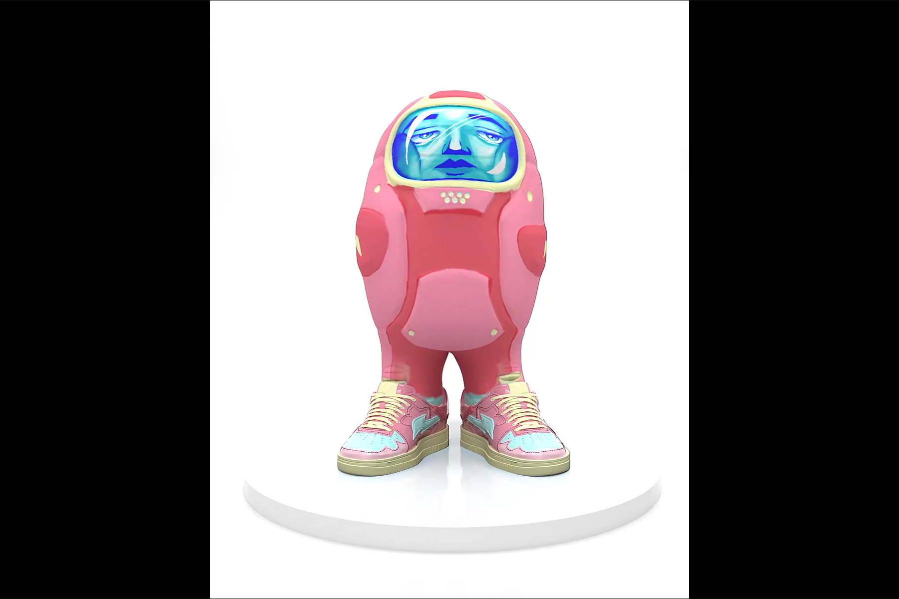

---
title: "RTFKT Capsule Space Drip 1.2"
description: "💎每个胶囊 0.5ETH ⚖️ Rev 份额和版税与所有创作者平分。 💯 345 粒胶囊出售 Gen 1.2 🚀 随机创作者在每个胶囊中滴水"
date: 2022-08-19T00:00:00+08:00
lastmod: 2022-08-19T00:00:00+08:00
draft: false
authors: ["boogArno"]
featuredImage: "rtfkt-capsule-space-drip-1-2.png"
tags: ["Collectibles","RTFKT Capsule Space Drip 1.2"]
categories: ["nfts"]
nfts: ["Collectibles"]
blockchain: "ETH"
website: "https://rtfkt.com/"
twitter: "https://twitter.com/rtfktstudios"
discord: ""
telegram: ""
github: ""
youtube: ""
twitch: ""
facebook: ""
instagram: "https://www.instagram.com/rtfktstudios"
reddit: ""
medium: ""
steam: ""
gitbook: ""
googleplay: ""
appstore: ""
status: "Live"
weight: 
lightgallery: true
toc: true
pinned: false
recommend: false
recommend1: false
---
RTFKT 在 2020 年 1 月 COVID 时代初期由三个朋友组成，诞生于元界，这已经定义了它的感觉。 RTFKT 是一个非常不拘一格、由创造者主导的组织。 RTFKT 使用最新的游戏引擎、NFT、区块链身份验证和增强现实，结合制造专业知识，创造出独一无二的运动鞋和数字产品。 RTFKT 以创造病毒式运动鞋设计、模因和独家收藏品而闻名。 RTFKT 一直保持着领先于技术前沿的声誉，这让许多人感到困惑，因为在数字时代的诞生中，他们似乎在研发方面缺乏与竞争对手巨头相比的资源和人力时尚。围绕 RTFKT 用于创建下一代设计的流氓 AI（从 Space X 窃取）的谣言是完全错误的，并且被 RTFKT 否认。绝对没有证据或法律行动来证明这些谣言是正当的。多年来，RTFKT 是一个未定义的集体，严格在暗中工作，为游戏公司和一些精选的时尚品牌提供设计和概念，2020 年他们成立了一个实体，将服务扩展到公共元市场。反响非常好，RTFKT 的社会发展几乎令人恐惧。 RTFKT 项目原定于 2040 年起飞，但人类意识发展的速度比预期的要快。我们现在在这里加速我们的数字化未来。

