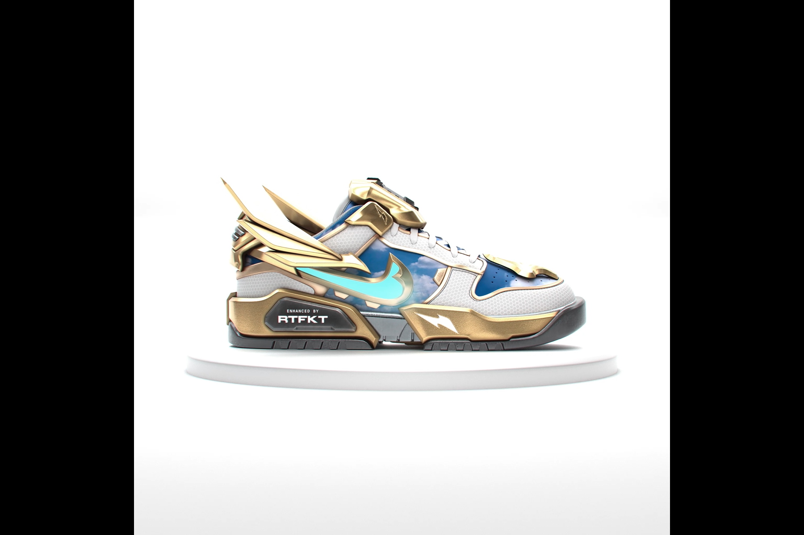

RTFKT 与 Nike 携手推出首款 RTFKT x NIKE CRYPTOKICKS NFT：由 DRM OS 和 Skin Vial Tech 提供支持的 RTFKT X NIKE DUNK GENESIS CRYPTOKICKS 运动鞋。
请阅读：由于区块链在购买时处理更改的速度不够快，因此不要购买/投标（on）装备的运动鞋。
为防止任何漏洞：我们建议不要尝试购买/竞标此系列中带有 Equipped Skins 的运动鞋。

“Nike Dunk Genesis CryptoKicks”这款虚拟产品以 Nike 备受追捧的 Dunk Low 系列低帮运动鞋为原型，借助 Skin Vial 技术，用户可以使用由 RTFKT 艺术家和社区合作者设计的独家皮肤自行创作这款 NFT 运动鞋。

