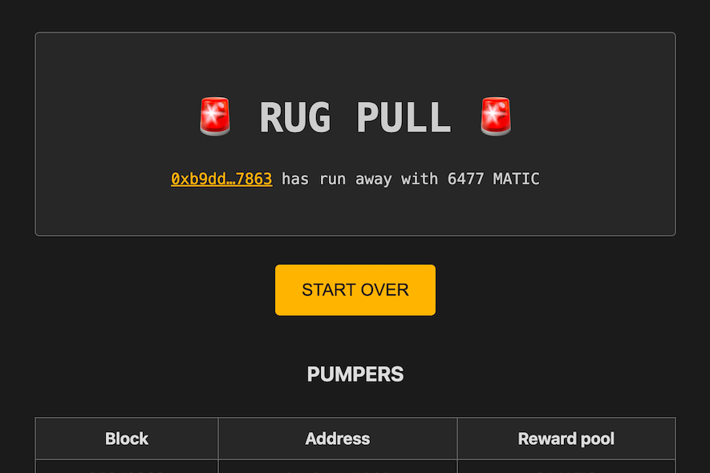

---
title: "Rug Pull Game"
description: "Polygon 区块链上令人上瘾的游戏，仅适用于 degens."
date: 2022-08-19T00:00:00+08:00
lastmod: 2022-08-19T00:00:00+08:00
draft: false
authors: ["boogArno"]
featuredImage: "rug-pull-game.png"
tags: ["Gambling","Rug Pull Game"]
categories: ["nfts"]
nfts: ["Gambling"]
blockchain: "Polygon"
website: "https://rugpullgame.xyz/"
twitter: "https://twitter.com/piotrekwilczek"
discord: ""
telegram: ""
github: "https://github.com/panpeter/rugpullgame"
youtube: ""
twitch: ""
facebook: ""
instagram: ""
reddit: ""
medium: ""
steam: ""
gitbook: ""
googleplay: ""
appstore: ""
status: "Live"
weight: 
lightgallery: true
toc: true
pinned: false
recommend: false
recommend1: false
---
具有 3 个简单规则的 Polygon 区块链游戏：
- 用 1 MATIC 抽取奖励池。
- 等待 30 个街区。
- 如果没有其他人抽水，您可以拉地毯并获得奖励池💰
拉地毯游戏由 Piotr Wilczek 创建。 该项目是开源的，可在 GitHub 上公开访问

Polygon（前身為Matic Network）是一個基於Layer2的擴容方案聚合器，讓所有的擴容方案都能輕鬆簡單的兼容以太坊，並且互相之間又能彼此相連，实現跨鏈，目標是圍繞以太坊打造一個像多边形一樣的多鏈網絡

