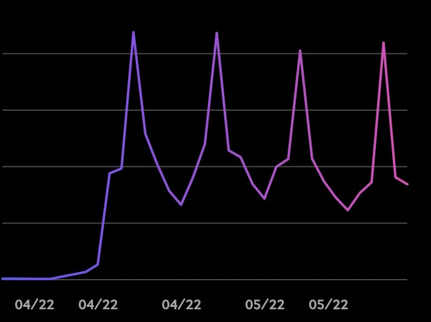

该代币的主要优先级是用于 Ruggable Degens 项目的扩展。 无论是奖励、交易、质押、流动性等，都会在未来的RDs项目中使用，并为NFTs提供流动性功能

RDST 每日表现
截至今天，最后报告的 RDST 价格为 0.0000088 美元。 RugDust 的最后一个市值未知。 24 小时 RDST 容量未知。 它的市值排名未知。 RugDust 在 0 个交易所交易。 5 个月前，RugDust 创下 0.00004771 美元的历史新高。 在过去的一天里，RugDust 的透明交易量为 0%，并且一直在 2 个活跃市场上进行交易，其最高交易量为 

.