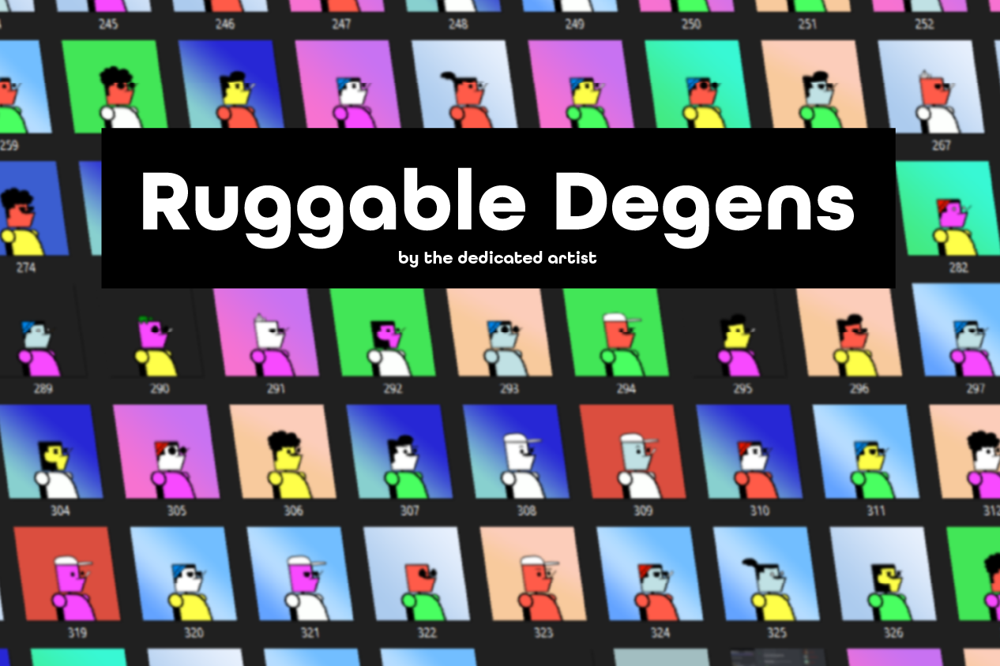

这个项目由@TheDedicatedArtist 创建，在某种程度上是一个流行的 DAO 的模因，称为 RUG。 虽然这个项目的灵感来自于 DAO，但它目前与其运营没有任何联系，并且以代表 Avax 链上最堕落的人而闻名。
Crypto 充满了 degens ......尤其是坚固的 degens。 这些 Ruggable Degens 已经逃离了真正的 Rugs 并进入了 Golden place。
有限的 NFT 集合，包含 500 个独特的 ERC-721 代币，以及即将到来的 Rug Splits。 该系列还有一个名为 RugDust 的 ERC-20 扩展。 做个堕落者进来吧！

