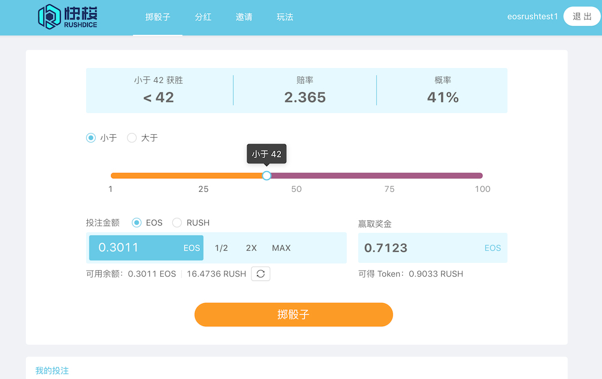

HTML使用 EOS 和 RUSH 代币的骰子游戏。

RushDice dApp 是一种基于EOS协议的赌博类别的加密资产。现在，根据用户数，它在一般 dApp 排名中排名第 3575位，在赌博类别中排名第 887位，这让您可以很好地了解RushDice dApp 在其竞争对手中的表现。

通过分析过去 30 天窗口中的 RushDice dApp 数据，很明显 dApp 的余额为64.41 美元，成交量以6.44美元看涨。RushDice产生了2 笔交易，在 30 天内上涨了100% 。显然，与之前的 7 天相比，成交量稳定了0% 。最近 7 天的数据显示，RushDice用户基数为2 & 一直在下降-100 %。

