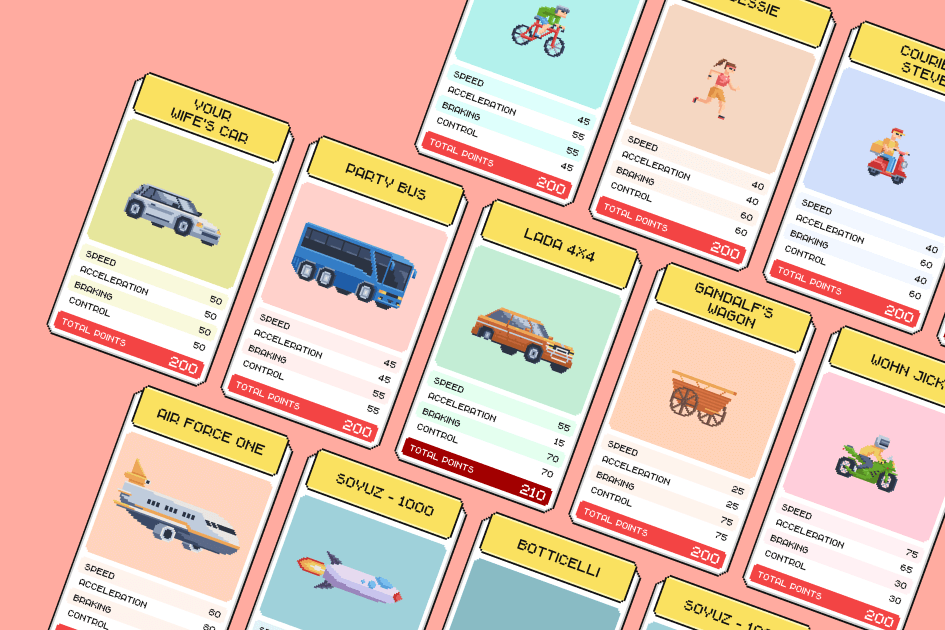

---
title: "Rust Cup Game"
description: "间接控制赛车！ 去中心化的区块链游戏！ 所有的逻辑都在智能合约中！ 购买你的 NFT，参加比赛，获胜!"
date: 2022-08-19T00:00:00+08:00
lastmod: 2022-08-19T00:00:00+08:00
draft: false
authors: ["boogArno"]
featuredImage: "rust-cup-game.png"
tags: ["NFT Games","Rust Cup Game"]
categories: ["nfts"]
nfts: ["NFT Games"]
blockchain: "Everscale"
website: "https://rustcupgame.com/"
twitter: ""
discord: ""
telegram: "https://t.me/rustcupgame"
github: "https://github.com/"
youtube: ""
twitch: ""
facebook: ""
instagram: ""
reddit: ""
medium: ""
steam: ""
gitbook: ""
googleplay: ""
appstore: ""
status: "Live"
weight: 
lightgallery: true
toc: true
pinned: false
recommend: false
recommend1: false
---
购买独特的赛车作为 NFT。 在每个人为自己模式中寻找 1x1 比赛或 4 人比赛的对手。
每场比赛都在一个独特的赛道上进行，其特征是随机生成的。
Rustcupgame 是一款间接控制的游戏。 您的任务是选择和升级您的汽车，使其赢得比赛。
准备好……稳定……开始！

Rust Cup Game 是一种间接控制的赛车拉力赛，玩家在不同难度的赛道上进行比赛。 要获胜，您需要选择自己的驾驶风格、车手并为赛道上的天气状况做好准备。

