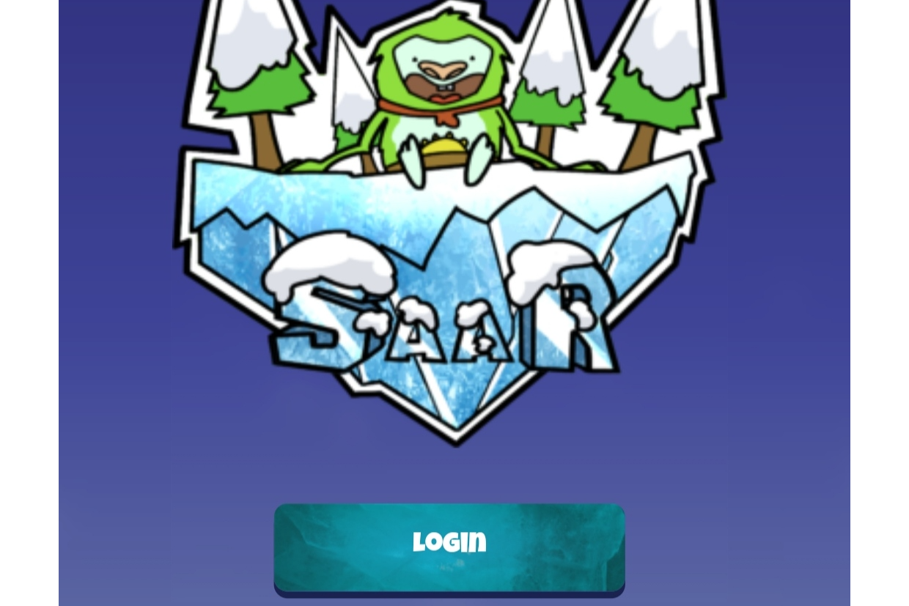

过雪人的生活，探索冰大陆的岛屿。 保护阿曼达巨大的冰冻圣洞并保持能量平衡。 不要因为资源稀缺和空间不足而让战争开始。 拥有、宣传、推广您的土地。 请注意保护它免受潜在入侵者的侵害。 在不同的 Yetis 的帮助下，开采木材、millirium 或生产可再生能源。 通过升级或建造新小屋来增加村庄的人口。 通过质押护身符获得采矿奖金。 努力从各种天气条件中受益。 让自己沉浸在虚拟现实中。 玩赚。 使用 SaaR 随时随地玩游戏。

