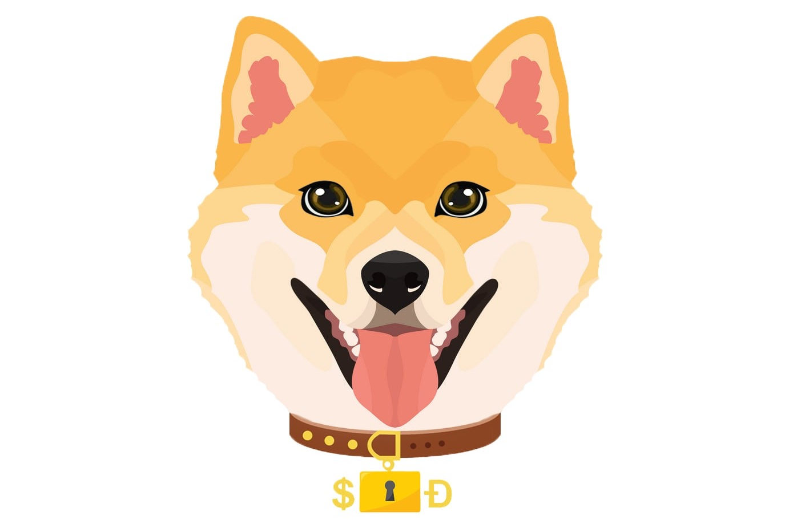

---
title: "SAFE DOGE"
description: "SAFEDOGE 🐕 是在#BSC 上为狗狗爱好者硬编码的无摩擦产量生成令牌。 📌 电报 - http://t.me/SafeDogeBNB"
date: 2022-08-20T00:00:00+08:00
lastmod: 2022-08-20T00:00:00+08:00
draft: false
authors: ["boogArno"]
featuredImage: "safe-doge.png"
tags: ["DeFi","SAFE DOGE"]
categories: ["nfts"]
nfts: ["DeFi"]
blockchain: "BSC"
website: "https://safedoge.dog/"
twitter: "https://twitter.com/safedogebnb"
discord: ""
telegram: ""
github: "https://github.com/safedogebnb"
youtube: ""
twitch: ""
facebook: ""
instagram: "https://t.me/safedogeann"
reddit: ""
medium: "https://medium.com/@SafeDogeBNB"
steam: ""
gitbook: ""
googleplay: ""
appstore: ""
status: "Live"
weight: 
lightgallery: true
toc: true
pinned: false
recommend: false
recommend1: false
---
SAFEDOGE”是在币安智能链上硬编码的无摩擦收益代币。
我们在币安智能链上构建了这个代币。 每次转账都要缴纳 10% 的税。
（4% 持有人费用，3% 流动性费用，2% 爱狗费用，1% 烧钱费用）

SafeDoge是基于币安智能链的孵化器，推出创新产品，社区获得生态代币奖励。

什么是安全狗
Safe Doge (SAFEDOGE) 目前按市值排名为#6413 加密货币。 今天它达到了 0.000000 美元的高位，现在位于 0.00 美元。

