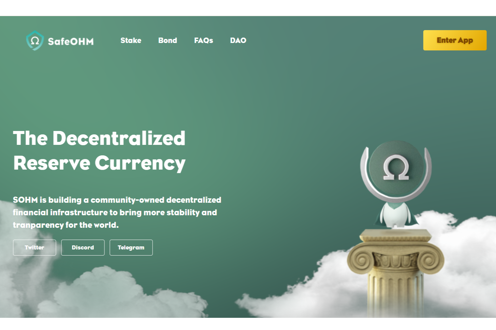

什么是 SafeOHM？

SOHM 是 SafeMoon 和 OHM 的混合体，OHM 是一种分散的金融储备协议，通过其社区拥有和受保护的国库提供复利。 $SOHM 在国库中有 BNB 支持，赋予其内在价值。
$SOHM 还通过赌注、绑定和出售惩罚引入了更好的 (3,3) 博弈论。

sohm 正在建立一个社区拥有的去中心化金融基础设施，为世界带来更多的稳定性和透明度

当前价格为每 SOHM ₩6,348,298.474393。新价格代表历史新高₩6,348,298.474393。

