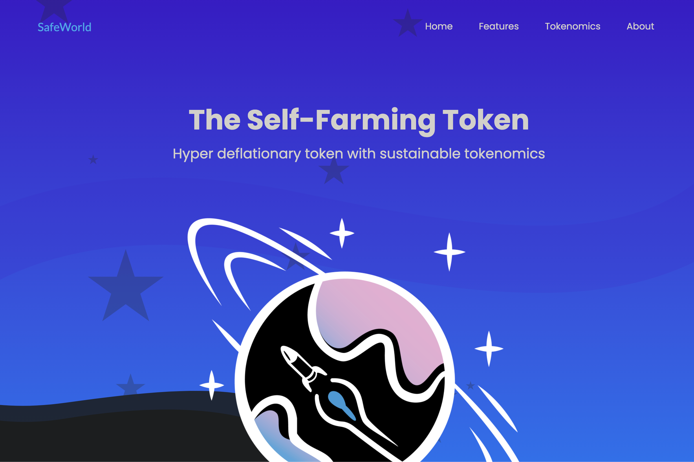

第一个多链、超通缩、自耕的代币。
被动投资的圣杯
使用 SafeWorld，您只需将代币放在钱包中即可获得奖励。
与传统农场不同，这些奖励将来自交易税再分配，而不是代币排放。
SafeWorld 是一个纯粹的通货紧缩代币，不能创建新的代币。
最重要的是，生态系统会鼓励反复燃烧，这反过来又会不断减少循环供应。
SafeWorld 上线后，将永远是 WorldSwap 生态系统的核心
仅通过持有代币即可获得奖励： - 所有交易的固定 5.6% 分配给持有者。 - 持有并获利：观察您的代币增加和获利。

