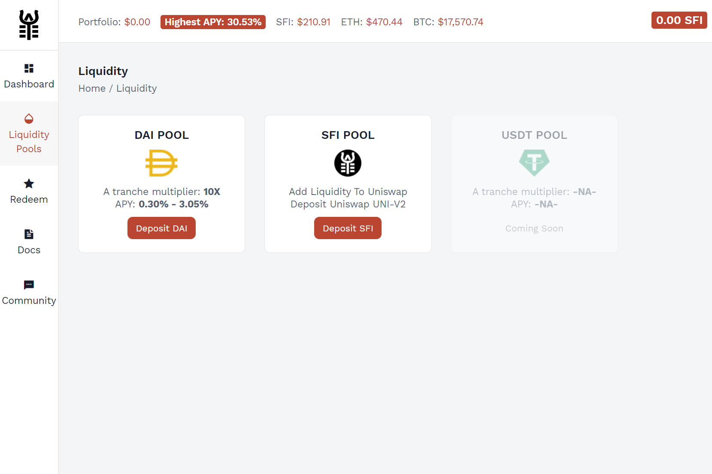

Saffron 是一种用于标记链上资产的协议，包括否则会损害获得已用资本的合同。链上资产的代币化所有权为流动性提供者提供了更大的灵活性和对其基础抵押品的不间断访问，同时实现了杠杆质押和定制风险管理。
现有的去中心化收益平台使流动性提供者面临复杂的代码驱动结果。网络参与者必须评估一系列灾难性场景，在这些场景中，最终状态可能会消灭他们的资产或导致重大的无常损失。很难预测极端市场波动或集中经济攻击的净影响。 Saffron 通过为流动性提供者提供动态风险敞口来缩小可能结果的范围。
现有的去中心化收益平台使流动性提供者面临复杂的代码驱动结果。网络参与者必须评估一系列灾难性场景，在这些场景中，最终状态可能会消灭他们的资产或导致重大的无常损失。很难预测极端市场波动或集中经济攻击的净影响。 Saffron 通过为流动性提供者提供动态风险敞口来缩小可能结果的范围。

