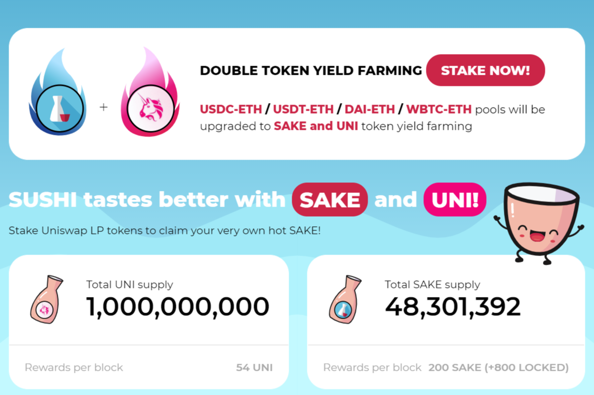

---
title: "SakeSwap"
description: "🍶 AMM 与 $SAKE 代币经济学
🍴 从 Uniswap 和 Sushiswap 分叉"
date: 2022-08-20T00:00:00+08:00
lastmod: 2022-08-20T00:00:00+08:00
draft: false
authors: ["boogArno"]
featuredImage: "sakeswap.png"
tags: ["DeFi","SakeSwap"]
categories: ["nfts"]
nfts: ["DeFi"]
blockchain: "ETH"
website: "https://sakeswap.fi/"
twitter: "https://twitter.com/sakeswap"
discord: "https://discord.com/invite/uYFVyNX"
telegram: "https://t.me/SakeSwap_Official"
github: ""
youtube: ""
twitch: ""
facebook: ""
instagram: ""
reddit: ""
medium: "https://medium.com/@sakeswap"
steam: ""
gitbook: ""
googleplay: ""
appstore: ""
status: "Live"
weight: 
lightgallery: true
toc: true
pinned: false
recommend: false
recommend1: false
---
受 Uniswap 和 Sushiswap 的启发，SakeSwap 旨在从价格曲线和贡献者奖励方面改进 AMM 的设计。
当 SAKE 治理上线时，SAKE 持有者可以提议对 SakeSwap 协议进行更改。 更改可能包括添加新池、更改 SAKE 权重或取消当前池。
所有与 SakeSwap 相关的智能合约都是开源的，具有🅦WTFPL 许可证。
SAKE Dev Fund 是为项目可持续性和项目安全审计而设立的。 每个 SAKE 分配的 6% 留出用于未来的迭代和治理建议的实施。 安全审计的所有费用也将由基金支付。

