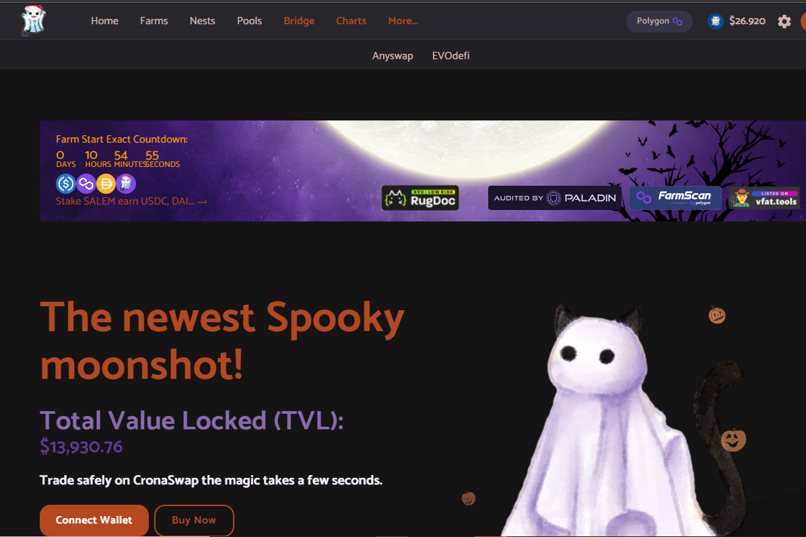

Salem Finance 是多个网络上的收益农场，该项目的主要重点是在耕作期间为我们的用户提供稳定的收入，您将能够质押其他代币以赚取原生代币 SALEM，该项目也算分红 矿池，用户可以在其中质押塞勒姆以赚取其他硬币，通常是马厩。
该团队不断致力于推广和合作，拥有像 PolyCrystal 这样强大的合作伙伴，并收集其他宝石以提供曝光。

通过投注我们的魔法金库和矿池来赚取收益。 您可以手动或自动复合，由您决定！

最新的幽灵登月！
总价值锁定（TVL）：
18,356.60 美元
在 CronaSwap 上安全交易需要几秒钟的时间。

