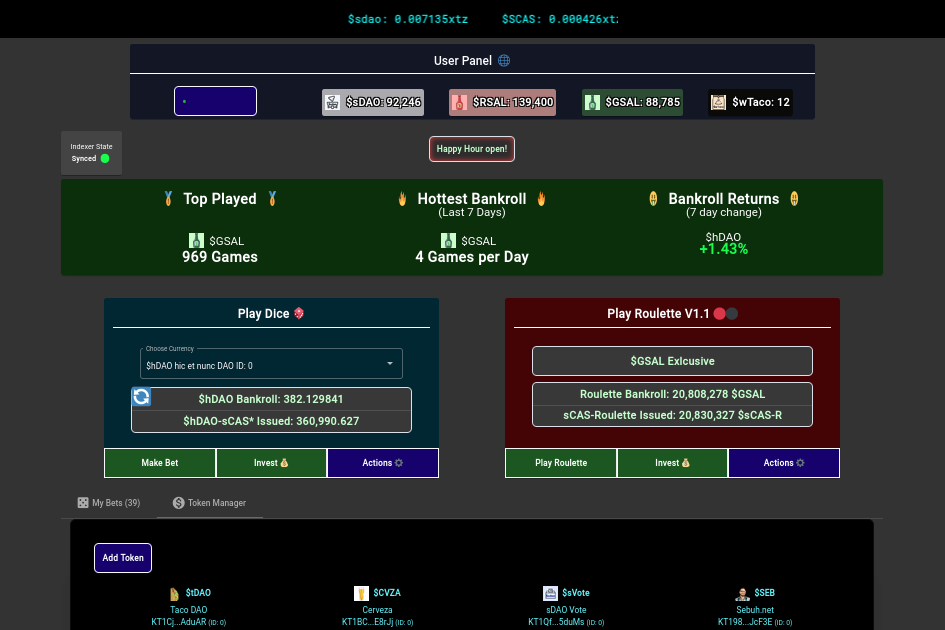

SalsaDAO 生态系统是由 Genius Contracts 构建的多个去中心化应用程序的集合。 SalsaDAO 跨越多个类别：NFT、DeFi、赌博、游戏、DEX 等。 SalsaDAO 的使命是为 Tezos 区块链上的用户创造有趣和创新的产品。 SalsaDAO 创造了 Tezos 的多项第一：第一个 Yield Farm、第一个 Generative Art NFT 游戏和第一个真正的草根 dApp 社区。
SalsaDAO 使用 $sDAO 作为整个生态系统的治理代币。 持有 $sDAO 可以获得社区投票、空投、预售访问等权利。 SalsaDAO 生态系统还包含许多用于与各种 dApp 交互的实用代币。
有关 SalsaDAO 及其历史的更多信息，请访问 Genius Contracts Medium 页面和我们的 SalsaDAO Wiki。

