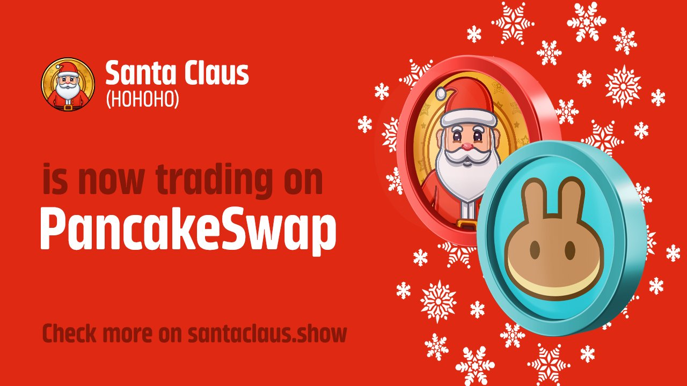

圣诞老人（HOHOHO）团队组织了由圣诞老人亲自呈现的 Crypto Christmas Live Show。 圣诞老人会在 Live Show 上从 HOHOHO 持有者中随机选择人，并赠送给他们有价值的加密礼物。 节目将于每年 20.12 在所有流行平台上直播。
我们相信圣诞老人将成为圣诞节期间发展最快的社区之一。 我们想创建在圣诞节期间连接的圣诞节加密家庭。 HOHOHO持有者也可以通过持有代币获得全年的礼物。
我们创建了圣诞老人质押池，持有者可以在其中质押 HOHOHO 以获得不同的 APY 奖励。 圣诞老人（HOHOHO）在市场上也有他自己的 NFT。

