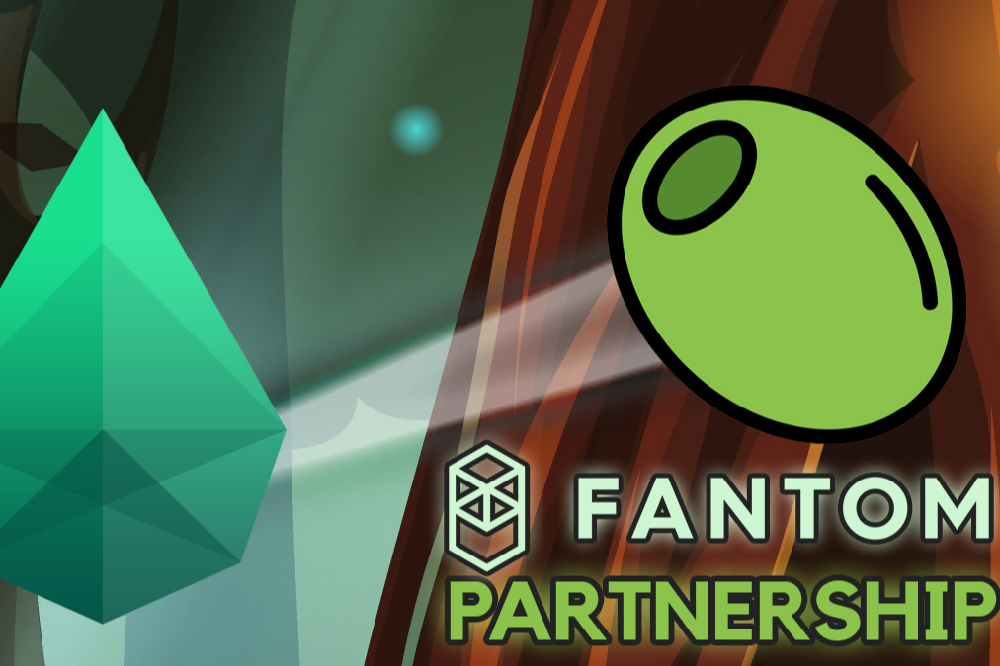

Sapphire DeFi，Fantom Network 上全新的多链 DeFi Yield Farming，帮助投资者保护他们的资金，因为我们提供透明的环境，让用户可以无忧使用我们的服务，并有助于通过 Staking 带来稳定的被动收入！ 以 0 美元的存款费质押并赚取原生代币！ 我们的主要目标是在 Fantom 网络上提供安全的 DeFi 收益农业！

DefiLlama 是 DeFi（去中心化金融）最大的 TVL 聚合器。我们的数据是完全开源的，由来自数百个协议的热情个人和贡献者组成的团队维护。

我们的重点是准确的数据和透明的方法。

我们跟踪来自 80 多个不同区块链的 800 多个 DeFi 协议。

