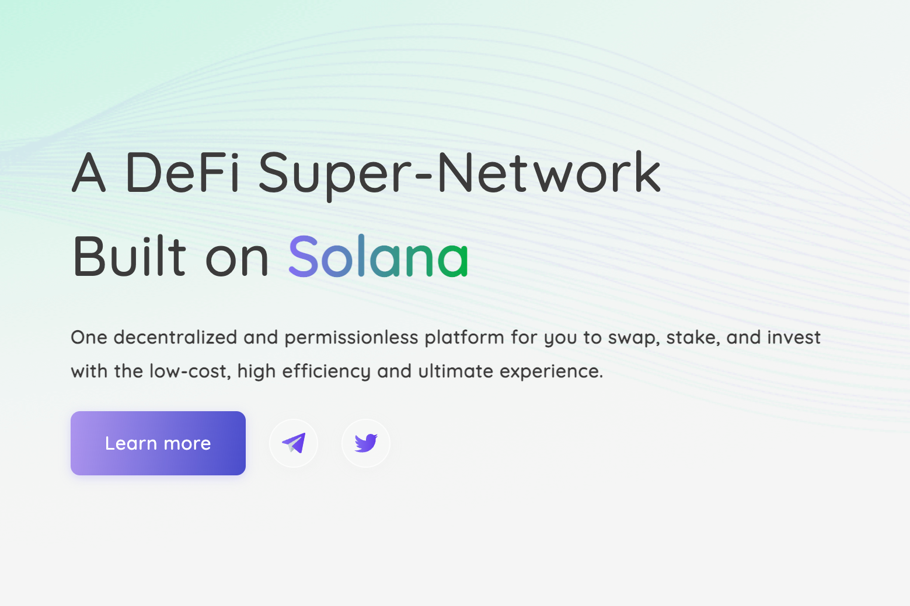

Saros Finance 是基于 Solana 的统一 DeFi 产品套件，具有三个基本构建块：SarosSwap (AMM)、SarosFarm 和 SarosStake，其中 SarosSwap 是整个生态系统的核心。
我们使用多种协议构建了 Saros Finance，以创建一个超级网络，吸引建设者和用户加入 Solana 生态系统。
SarosSwap 将最大化价格发现，将散户投资者吸引到 Solana。
SarosFarm 和 Saros 将吸引和吸引流动性提供者，从而导致大量资金流入，同时简化和加速流动性引导并鼓励在 Solana 上建立新项目。
很明显，Saros Finance 将不仅限于 3 个构建块，还将继续分支到各种协议以满足未来用户的需求。

