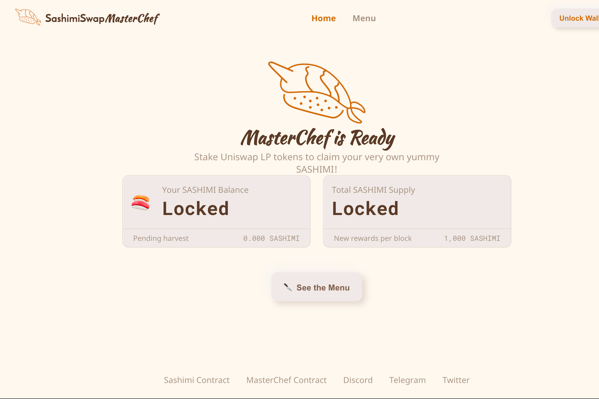

---
title: "SashimiSwap"
description: "SashimiSwap (sashimi.cool) 是一个受 Uniswap 启发的投资平台，致力于“倍增”流动性提供者的被动收入."
date: 2022-08-20T00:00:00+08:00
lastmod: 2022-08-20T00:00:00+08:00
draft: false
authors: ["boogArno"]
featuredImage: "sashimiswap.png"
tags: ["DeFi","SashimiSwap"]
categories: ["nfts"]
nfts: ["DeFi"]
blockchain: "ETH"
website: "https://sashimi.cool/"
twitter: "https://twitter.com/SASHIMISASHIMI5"
discord: "https://discord.gg/zTdmUkb"
telegram: "https://t.me/joinchat/KABj-Bz6CVzyi23HK2rjzA"
github: "https://github.com/SashimiProject/sashimiswap"
youtube: ""
twitch: ""
facebook: ""
instagram: ""
reddit: ""
medium: "https://medium.com/sashimisashimi"
steam: ""
gitbook: ""
googleplay: ""
appstore: ""
status: "Live"
weight: 
lightgallery: true
toc: true
pinned: false
recommend: false
recommend1: false
---
SashimiSwap (sashimi.cool) 是一个受 Uniswap 启发的投资平台，致力于“倍增”流动性提供者的被动收入。与大多数其他平台主要依赖交易费用不同，SashimiSwap 除了交易费用外，还通过优化自动将部分闲置流动性投资到最有利可图的平台来倍增投资回报，每天动态调整。一个类比是货币兑换商，将他/她多余的闲置货币存入最好的银行，以获得最大的利润。
SASHIMI是SashimiSwap平台上的Token，通过流动性挖矿100%分发，不进行任何预售、预挖、团队分享。 SASHIMI Token 的持有者可以通过质押参与治理并获得 SashimiSwap 分红。 Sashimi hodlers 的收入来源现在包括来自 Vaults 的交易费、流动性投资和服务费，并持续开发和提供额外的收入途径。

