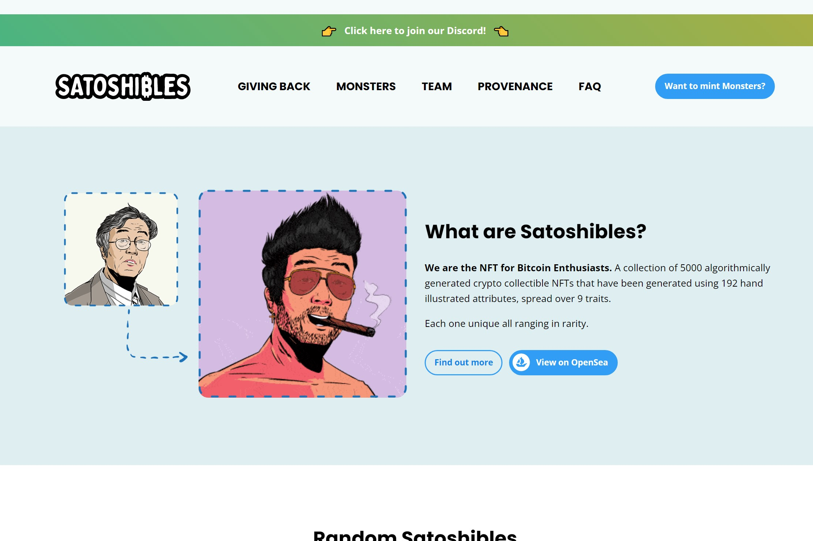

Satoshibles 是比特币爱好者的 NFT。使用 192 个手绘属性生成的 5000 个算法生成的加密收藏 NFT 的集合，分布在 9 个特征上。每一件都是独一无二的，稀有程度不一。
Satoshibles 是第一个通过 Stacks 搭建从以太坊到比特币的桥梁的 NFT 项目。**我们是比特币爱好者的 NFT。**使用 192 个手绘属性生成的 5000 个算法生成的加密收藏 NFT 的集合，分布在 9 个特征上。

每一件都是独一无二的，稀有程度不一。

