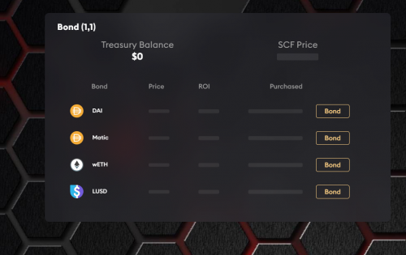

---
title: "Scoof Dao"
description: "Scoof 协议是 Olympus DAO 在 Matic Chain 上的改进分叉，是一种算法储备货币，在有限的时间内提供高达 10 亿% 的收益率 APY"
date: 2022-08-19T00:00:00+08:00
lastmod: 2022-08-19T00:00:00+08:00
draft: false
authors: ["boogArno"]
featuredImage: "scoof-dao.png"
tags: ["DeFi","Scoof Dao"]
categories: ["nfts"]
nfts: ["DeFi"]
blockchain: "Polygon"
website: "https://scoofdao.digital/"
twitter: "https://twitter.com/scoofProtocal"
discord: "https://discord.gg/z2c4jGN95A"
telegram: ""
github: ""
youtube: ""
twitch: ""
facebook: ""
instagram: ""
reddit: ""
medium: ""
steam: ""
gitbook: ""
googleplay: ""
appstore: ""
status: "Live"
weight: 
lightgallery: true
toc: true
pinned: false
recommend: false
recommend1: false
---
Scoof 正在建立一个社区拥有的去中心化金融基础设施，为世界带来更多的稳定性和透明度。
我们正在将协议拥有的流动性带到您附近的 DAO。
Scoof 以复利奖励质押者，这使得质押随着时间的推移变得更加有利可图。
价值存储是一种随着时间的推移稳定或增值的资产。稳定币容易受到通货膨胀政策的影响，而比特币则遭受市场崩盘或操纵。这些都不是真正的价值存储。
SCF 旨在无限增值
SCF 得到了不断增长的创收金库的支持。我们创造了一种能够在市场条件下不断提高购买力的货币。

