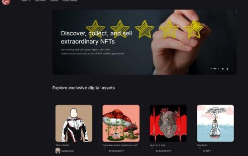

---
title: "SCOPXNFT"
description: "SCOPXNFT Marketplace 建立在币安智能链之上。安全地买卖独特的数字收藏品。所有 NFT 市场的最低交易成本保证"
date: 2022-08-19T00:00:00+08:00
lastmod: 2022-08-19T00:00:00+08:00
draft: false
authors: ["boogArno"]
featuredImage: "scopxnft.png"
tags: ["Marketplaces","SCOPXNFT"]
categories: ["nfts"]
nfts: ["Marketplaces"]
blockchain: "BSC"
website: "https://scopxnft.com/"
twitter: "https://twitter.com/scopxtoken"
discord: ""
telegram: ""
github: ""
youtube: ""
twitch: ""
facebook: ""
instagram: ""
reddit: ""
medium: ""
steam: ""
gitbook: ""
googleplay: ""
appstore: ""
status: "Live"
weight: 
lightgallery: true
toc: true
pinned: false
recommend: false
recommend1: false
---
SCOPXNFT Marketplace是一个基于币安智能链（BEP721）入口的NFT交易平台，以最佳的客户体验创建、购买、出售和使用NFT。 SCOPXNFT Marketplace 是币安智能链中 NFT 多样性的一个非常清晰的交易平台。您可以通过收集最大的聚合体以获取利润，以高度处理的方式在组织中制作、购买和收集您的艺术品。
NFT 以最可靠的方式呈现任何事物的独特性的能力使其成为创客经济的出色扩展，并以不同的缩进方式占据了它。借助 NFT，高级美术目前具有真正的价值，这在区块链上都是毫无疑问的。看看 NFT 空间的发展方向，并考虑支持技术的区块链获得了多少标准接收，这并不是一蹴而就的。

