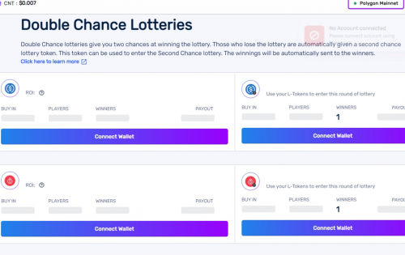

---
title: "Second Chance Lottery"
description: "Second Chance Lotteries 是一种新型彩票，让输家有第二次获胜的机会。"
date: 2022-08-19T00:00:00+08:00
lastmod: 2022-08-19T00:00:00+08:00
draft: false
authors: ["boogArno"]
featuredImage: "second-chance-lottery.png"
tags: ["NFT Games","Second Chance Lottery"]
categories: ["nfts"]
nfts: ["NFT Games"]
blockchain: "Polygon"
website: "https://app.cryption.network/"
twitter: "https://twitter.com/CryptionNetwork"
discord: "https://discord.gg/USXYEte"
telegram: "https://t.me/CryptionNetwork"
github: ""
youtube: "https://www.youtube.com/channel/UCpvGIJNX8bhzY1UC6NYNjRg"
twitch: ""
facebook: "https://www.facebook.com/CryptionNetwork"
instagram: "https://www.instagram.com/cryptionnetwork/"
reddit: ""
medium: "https://blog.cryption.network/"
steam: ""
gitbook: ""
googleplay: ""
appstore: ""
status: "Live"
weight: 
lightgallery: true
toc: true
pinned: false
recommend: false
recommend1: false
---
Second Chance Lotteries 是一种新型彩票，让输家有第二次获胜的机会。在这个彩票中输入不同的游戏，然后再试一次，有机会获胜。使用双重机会彩票，如果您输了彩票也没关系，因为您可以再玩一次，并有望获胜。
所有未中奖的用户都可以使用 L 代币（LUSDC、LARTH、LCNT 等）在第二次彩票中再次尝试。本次抽奖的所有规则与之前保持一致，中奖者将在所有名额填满后立即获得奖金。
使用双抽奖机制，Cryption Network 确保每个参与者都有机会增加他们的资产。 Cryption Network 还在为 USDC、BLES、ARTH 和 CNT 代币进行抽签。

