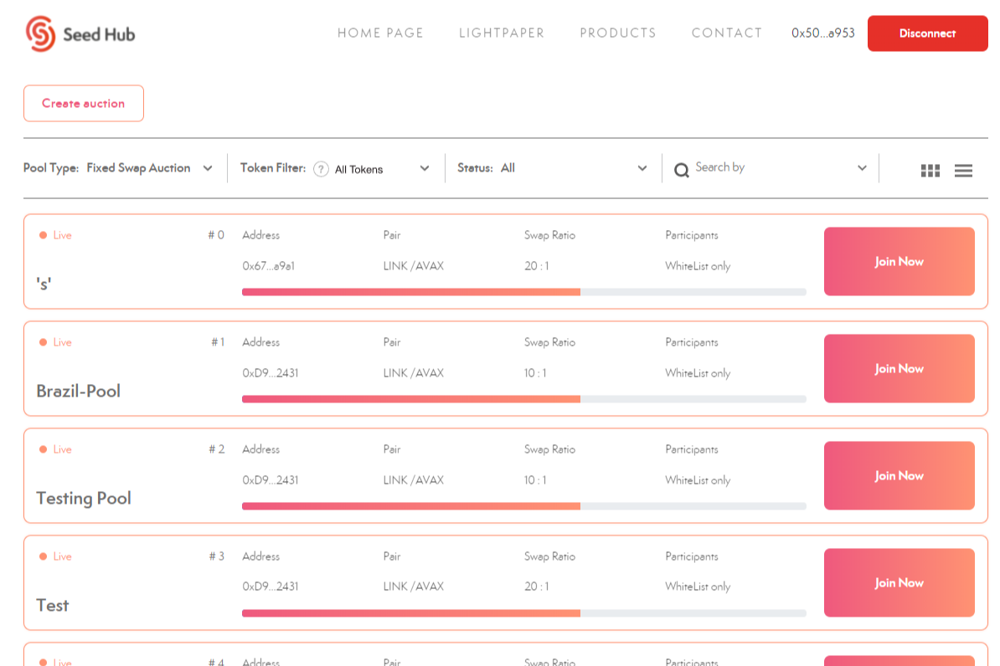

虽然许多现有平台各自应用他们选择的融资机制，但没有一个单一的融资基础设施可以在同一屋檐下提供多种方法。不同的参与机制最终使大投资者能够获得更大的资金，造成小投资者的挫败感，并抑制新投资者的加入积极性。
这在具有基于分层的分配方案的启动板中得到了最好的观察，并让位于复制粘贴启动板的扩散，以便新的投资者群体可以享受早期加入的好处。每个平台对参与的要求不同，也会让参与者感到困惑，他们很难跟上。
Seed Hub 为您提供可以消除所有这些问题的产品包。

