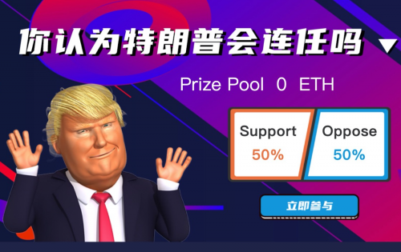

---
title: "SEER"
description: "SEER是一个基于以太坊协议的去化中心，让玩家可以对玩家的未来事件进行投注，让创造英雄对决胜负。"
date: 2022-08-19T00:00:00+08:00
lastmod: 2022-08-19T00:00:00+08:00
draft: false
authors: ["boogArno"]
featuredImage: "seer.png"
tags: ["High risk","SEER"]
categories: ["nfts"]
nfts: ["High risk"]
blockchain: "ETH"
website: "https://seer.bet/"
twitter: "https://twitter.com/bet_seer"
discord: "https://discord.gg/KNdtkUY"
telegram: "https://t.me/seerofficial"
github: ""
youtube: "https://youtube.com/channel/UCgvT3fOQ2Cf2IJD1SpJhlyQ"
twitch: ""
facebook: "https://www.facebook.com/Seer-Games-105262278043028"
instagram: ""
reddit: ""
medium: ""
steam: ""
gitbook: ""
googleplay: ""
appstore: ""
status: "Live"
weight: 
lightgallery: true
toc: true
pinned: false
recommend: false
recommend1: false
---
什么是 SEER？
先知，顾名思义，可以预见未来发生的事件。当预言家对同一主题有不同意见时，他们会安排合约，当未来成真时，赢家通吃！
先知：怎么玩？
合同分为三种类型：官方、标准和创意。
官方合约：官方团队创建的这些合约，通常与比较重大的事件相关，事件的结果可以客观地观察和证明。
标准合约：官方提供了一系列标准模板，玩家可以根据这些模板创建自己的合约。各类合约模板涵盖加密货币、股票行情、黄金交易、体育等。事件的结果可以客观地观察和证明。
创意合约：由玩家直接创建，由于合约内容限制相对较少，发布前会提交官方团队审核。事件的结果可以客观地观察和证明。
合约有两个阶段——投注阶段和待定阶段。投注阶段通常小于或等于待定阶段的三分之一。越早参与，投注金额相同，获得的额外奖励越多。投注阶段结束后，任何人都不能参与，直到合同完成，结果得到验证。
什么是契约异议？
Dissida of Contract（DoC）是一款基于以太坊智能合约的决斗游戏。玩家可以生成具有五个属性、一个职业和一个元素的英雄。属性、职业和元素可以用少量的SEE来重置。当玩家对自己英雄的属性感到满意时，他们可以进入战场与其他玩家决斗。

