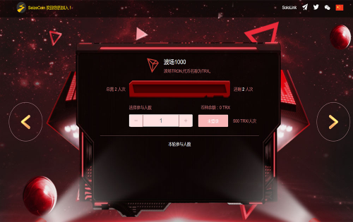

---
title: "SeizeCoin"
description: "一款基于Tron.Network的夺币游戏，玩家VS玩家。"
date: 2022-08-19T00:00:00+08:00
lastmod: 2022-08-19T00:00:00+08:00
draft: false
authors: ["boogArno"]
featuredImage: "seizecoin.png"
tags: ["High risk","SeizeCoin"]
categories: ["nfts"]
nfts: ["High risk"]
blockchain: "TRON"
website: "https://seizecoin.world/"
twitter: "https://twitter.com/SeizeCoin"
discord: ""
telegram: ""
github: ""
youtube: ""
twitch: ""
facebook: ""
instagram: ""
reddit: ""
medium: ""
steam: ""
gitbook: ""
googleplay: ""
appstore: ""
status: "Live"
weight: 
lightgallery: true
toc: true
pinned: false
recommend: false
recommend1: false
---
一款基于Tron.Network的夺币游戏，玩家VS玩家。

SEIZECOIN 今天的价格为 0 美元，24 小时交易量为 0 美元。 SEIZECOIN 价格在过去 24 小时内上涨了 0%。它有一个循环供应1,000,000,000,000,000SEIZECOIN 硬币和总供应量1,000,000,000,000,000SEIZECOIN. 如果您想购买或出售 SEIZECOIN, PancakeSwap (v2) 是目前最活跃的交易所。SEIZE THE MEMES COIN 是一个去中心化的金融支付网络，在区块链上重建传统的支付栈。它利用一篮子与法币挂钩的稳定币，由其储备货币在算法上稳定 SEIZECOIN, 促进可编程支付和开放金融基础设施的发展。截至 2020 年 12 月，该网络已为超过 200 万用户进行了约 2990 亿美元的交易。

