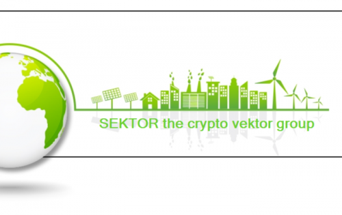

SEKTOR 是 Sektor 加密指导小组的项目代币。这是服务范围的重要组成部分，也用于可视化各个项目包。我们将我们的可能性和经验作为真正的产品提供，并将其直接与我们的投资组合交织在一起，从而使所有投资者和持有者都能参与项目的整体成功。实施、应用和效益的融合是项目成功的基本经济因素。特别是通过指导过程的应用，我们可以积极影响项目的进程，从而确保在开发过程中产生影响。我们的使命是建立更多增值项目，从而对区块链采用的发展产生可持续的影响。

