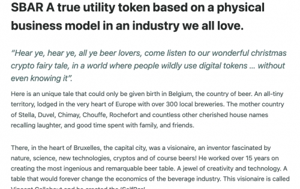

SelfBar 管理无现金和自助饮料机的制造和分销。这些机器被放置在零售空间、活动场所、体育场等......任何必须快速供应大量饮料的地方。
为了操作机器，消费者在卡上收取饮料积分。可以使用法定货币或使用我们的 SBAR 实用代币对卡进行收费。
SBAR 代币有 3 个用途：(1) 作为一种实用代币，它可以兑换饮料积分。 (2) 作为支付代币，可用于支付饮料行业参与者的服务费用。 (3) 作为审计线索，以保证 SelfBar 机器操作的安全性和透明度。

