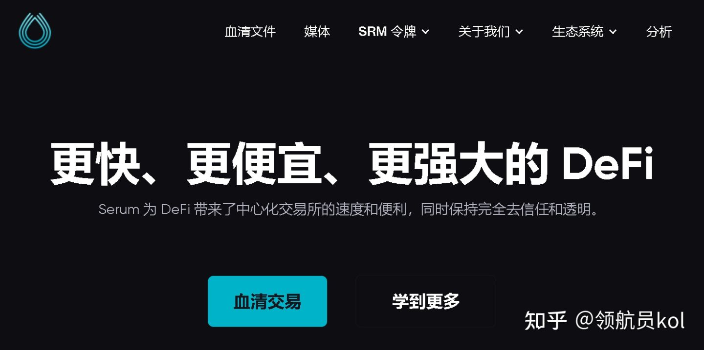

xxxxxxxxxx Serum 为 DeFi 带来了中心化交易所的速度和便利，同时保持完全去信任和透明。Serum 是一种去中心化交易所协议，为去中心化金融带来前所未有的速度和低交易成本。它建立在 Solana 之上，完全无需许可。更快、更便宜、更强大的 DeFi
Serum 为 DeFi 带来了中心化交易所的速度和便利，同时保持完全去信任和透明。了解更多关于血清
Serum 是一种去中心化交易所协议，为去中心化金融带来前所未有的速度和低交易成本。它建立在 Solana 之上，完全无需许可。

