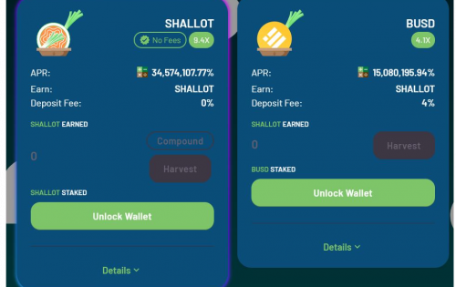

---
title: "Shallotdefi"
description: "ShallotDefi 是运行在币安智能链和 Polygon 上的去中心化交易所，具有独特的功能，为您提供全新的农场体验！
青葱定义"
date: 2022-08-19T00:00:00+08:00
lastmod: 2022-08-19T00:00:00+08:00
draft: false
authors: ["boogArno"]
featuredImage: "shallotdefi.png"
tags: ["DeFi","Shallotdefi"]
categories: ["nfts"]
nfts: ["DeFi"]
blockchain: "BSC"
website: "https://shallotdefi.com/"
twitter: "https://twitter.com/shallotdefi"
discord: ""
telegram: "https://t.me/shallotcm"
github: "https://github.com/shallotdefi"
youtube: ""
twitch: ""
facebook: ""
instagram: ""
reddit: ""
medium: "https://medium.com/@shallotdefi"
steam: ""
gitbook: ""
googleplay: ""
appstore: ""
status: "Live"
weight: 
lightgallery: true
toc: true
pinned: false
recommend: false
recommend1: false
---
自动流动性自动燃烧反鲸鱼
主要特点‌
ShalotDefi 的每次转让必须缴纳 5.5% 的转让税。 4.4% 的转让税通过合约自动添加到流动性池中，以不断提高价格下限。这种流动性是自动锁定的。
正如我们上面提到的，ShallotDefi 的每笔转让都必须缴纳 5.5% 的转让税。 1.1% 的转让税将分配给自动流动性获取。 1.1%的剩余转让税将立即被烧掉。整个过程是自动的。
超过总供应量 0.15% 的转账将被拒绝。随着总供应量的增加，这个比例会降低。

