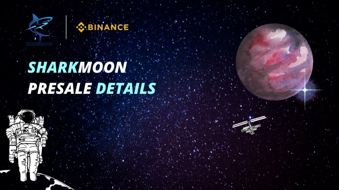

SharkmoonFinance 是一个运行在币安智能链上的自动流动性获取收益农场和 AMM 去中心化交易所，具有许多独特和创造性的功能，让您赚取和赢取。SHARKMOON 是运行在币安智能链上的自动流动性获取收益农场和 AMM 去中心化交易所，具有许多独特和创造性的功能，让您赚取和赢取。‌我们完全支持 CAKE-LP v2 质押。‌如前所述，每笔交易有 5% 的转让税，3% 的转让税将通过合约自动添加到 SHM-BNB 流动性池中。

