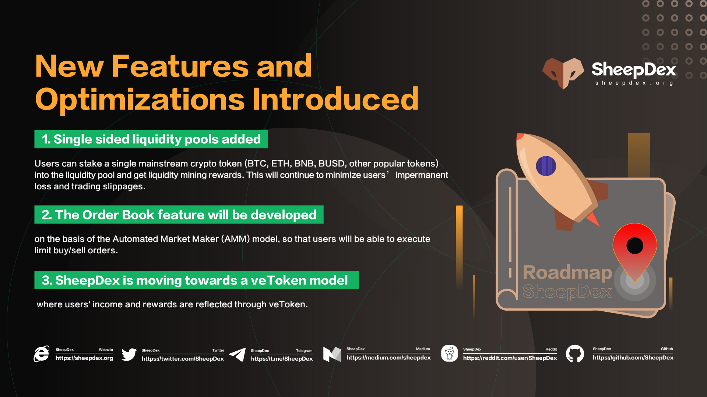

SheepDex 是第一个集现货和衍生品交易于一体的去中心化交易所（DEX）。既提供LP交易手续费返还，也提供交易者交易奖励，同时允许流动性提供者（LP）在一定价格范围内进行资金配置，从而提高资金效率，减少滑点，集中交易深度。
未来，SheepDex 将继续推出永续合约、杠杆代币、彩票等更多创新功能。
SheepDex 旨在成为去中心化的币安。SheepDex 自推出以来就获得了很多的喜爱和支持。我们致力于保障用户资产和交易环境的安全，不断优化产品，提升产品性能和用户体验。

