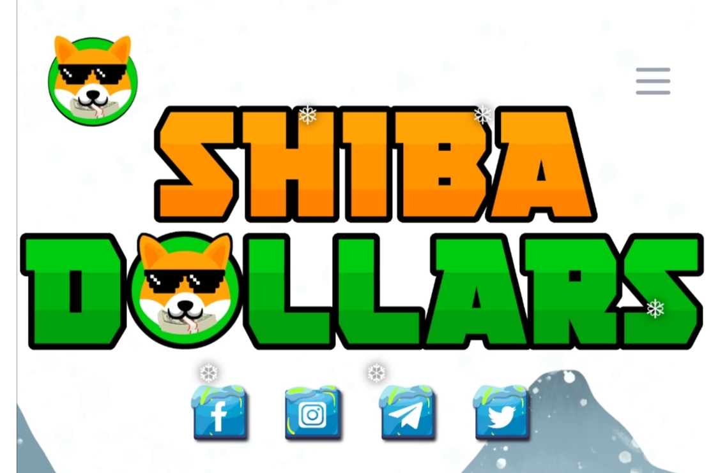

具有 BUSD 利益的超通缩代币。
Shibadollars 致力于自主的无摩擦收益农业和流动性生成协议。只需在您的钱包中持有 Shibadollar 代币，您就可以赚取 Binance-USD (BUSD)。 1,000% 到 50,000% 并非不可能！
持有 Shibadollars 的钱包会从每笔交易中获得 8% 的 BUSD 形式的奖励。它将自动实时发送到所有合格的钱包。
从每笔交易中收集 2% 的代币并转换为 BNB 并存储在智能合约中。这个钱包被称为绿色钱包。激活后，它会从交易所购买 Shibadollars，并将其从循环供应中永久移除，从而产生绿色蜡烛。这种机制也稳定了 Shibadollars 的价格。

