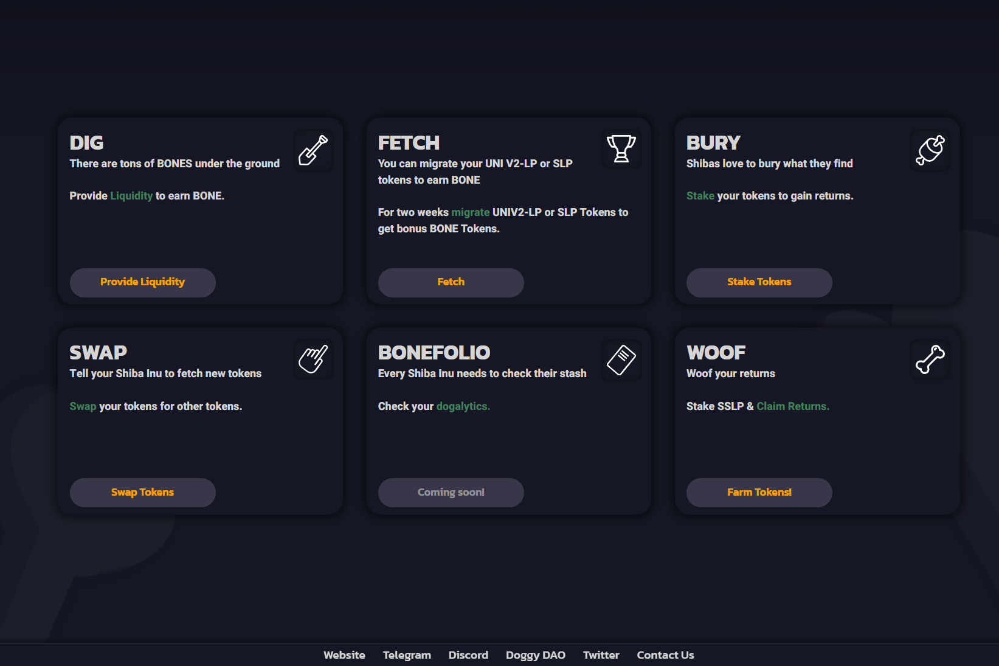

---
title: "ShibaSwap"
description: "SHIB、LEASH、BONE — ShibaSwap — 创新奖励系统 — Shiba 孵化器 — 等等。 585k+ 社区成员和快速增长！"
date: 2022-08-19T00:00:00+08:00
lastmod: 2022-08-19T00:00:00+08:00
draft: false
authors: ["boogArno"]
featuredImage: "shibaswap.png"
tags: ["DeFi","ShibaSwap"]
categories: ["nfts"]
nfts: ["DeFi"]
blockchain: ""
website: "https://shibaswap.com"
twitter: "https://twitter.com/shibtoken"
discord: "https://discord.com/invite/shibatoken"
telegram: "https://t.me/shibainuthedogecoinkiller"
github: ""
youtube: ""
twitch: ""
facebook: ""
instagram: ""
reddit: ""
medium: ""
steam: ""
gitbook: ""
googleplay: ""
appstore: ""
status: "Live"
weight: 
lightgallery: true
toc: true
pinned: false
recommend: false
recommend1: false
---
从一开始，柴犬就以不同的方式做事。我们的创始人 Ryoshi 从 1 万亿的供应开始，将 50% 锁定在 Uniswap，然后将另一半“烧掉”给以太坊联合创始人 Vitalik Buterin 保管。为了帮助扭转 Covid-19 在印度的毁灭性蔓延，VB 此后在历史上最大的加密货币捐赠中使用了 SHIB，然后实际上将其总供应量的 40% 烧毁了一个死钱包，确保了我们的长期成功和稳定性。用 Ryoshi 的话来说，“感谢 woofmeister 实现了真正的去中心化。现在我们真正开始了。”

