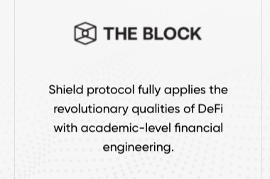

Shield 正在为未来的衍生品基础设施构建一种基于完全非合作游戏的独一无二的去中心化协议，从而实现全球无国界的融资渠道。永续期权是我们第一个创新的长期链上期权，无需在 Shield 协议上构建滚动头寸的努力、风险或费用。通过运行由做市商量身定制的期权策略，赚取主流代币或稳定币存款的收益。通过直接向代币发行人出售有担保的看涨期权来获得单面代币质押的收益。通过运行量身定制的期权策略获得 LP 代币质押的收益。

