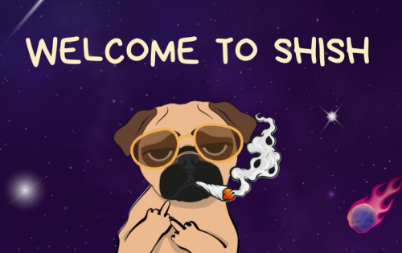

Project SHISH 是一个基于 meme 的项目，它使用 NFT Artwork 来促进动物爱好者、艺术家和保护者的动物权利，包括那些支持动物收容所和残疾动物收容所的人。 SHISH Coin 是一个 NFT 艺术项目，旨在使用 NFT 影响和传播信息，以鼓励动物倡导者和艺术家进行合作。双方在 NFT 代币上的合作将对改善动物生活、让动物爱好者改善动物生活产生可持续的影响。我们计划发布我们的 SHISHA 面具系列，将与动物慈善活动密切合作。我们有非常宏大的全球计划来扩展我们的元宇宙。我们想帮助所有存在的动物。

