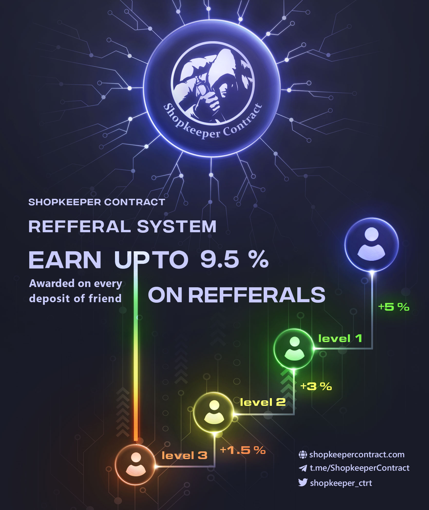

店主合同，下一代 ROI 合同。
Shopkeeper Contract 通过质押您的 matic 代币每天获得 7% 的收益。
每 5 天将您的本金加注 20% 以使底池变甜。
提现没有限制。你的Yield，你随时退出。
它经过大量优化以节省交互气体并且没有退出错误。所有 v1 投资者都将退还原始金额。数据在区块链上可用，因此我们不需要任何支持机器人或表单来处理它。谢谢你的耐心。PS：与其他计划不同，我们的推荐系统不仅会奖励首次存款，还会奖励每次后续存款。

