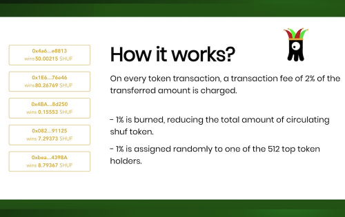

---
title: "Shuffle.Monster V3"
description: "Shuffle.Monster V3 [代码：SHUF]

?它是如何工作的"
date: 2022-08-20T00:00:00+08:00
lastmod: 2022-08-20T00:00:00+08:00
draft: false
authors: ["boogArno"]
featuredImage: "shuffle-monster-v3.png"
tags: ["Gambling","Shuffle.Monster V3"]
categories: ["nfts"]
nfts: ["Gambling"]
blockchain: "ETH"
website: "https://shuffle.monster/"
twitter: "https://twitter.com/ShuffleToken"
discord: ""
telegram: "https://t.me/shuftoken"
github: ""
youtube: ""
twitch: ""
facebook: ""
instagram: ""
reddit: "https://www.reddit.com/user/Shuffle_Monster"
medium: ""
steam: ""
gitbook: ""
googleplay: ""
appstore: ""
status: "Live"
weight: 
lightgallery: true
toc: true
pinned: false
recommend: false
recommend1: false
---
Shuffle.Monster V3 [代码：SHUF]

?这个怎么运作？

1) 最初创建了 1,010,101 SHUF。

2) 每次转入 SHUF，交易的 2% 以这种方式收取： ? - 1% 的交易被销毁（Burned），？ - 1% 随机分配给 512 名顶级代币持有者之一（奖励）。

3) 在每笔交易中，随机持有者（前 512 名持有者中）将获得直接转账到其地址的交易的 1% 的奖励，根据定义，这是一种堆叠货币。

4) 永远不会有新铸造的 SHUF，因此由于不断燃烧，每天的 SHUF 都会减少，因此从定义上讲，这就是通货紧缩货币。&nbsp;

&nbsp;

☑️ 归根结底，SHUF 只是另一个社会实验，我们和你一样好奇，想知道它会走向何方……

☑️ 对于实时价格、市场统计数据和代币经济学数据，请使用我们 Telegram Group 中的 Shuffle Bot。&nbsp;

