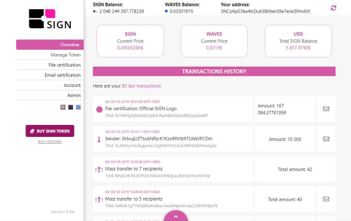

签名链 (SIGN) 是一个在线平台，允许对去中心化 Waves 区块链上的任何数据和文档进行认证。

在 Signature Chain (SIGN)，我们在为新兴国家构建用于可持续发展项目平台的集中式应用程序方面经验丰富，并致力于处理大量文件和认证步骤的其他各种项目。

我们已经研究并确定了哪些可以促进和加速使用区块链技术的许多企业领域的认证过程，这提供了关于安全性、自主性和执行时间的最佳保证。

我们的经验和当前知识激励我们解决文件伪造问题和处理耗时的认证过程。我们当前的平台允许认证不同类型的文件，例如合同、身份、研究论文、发明、艺术品等等。

