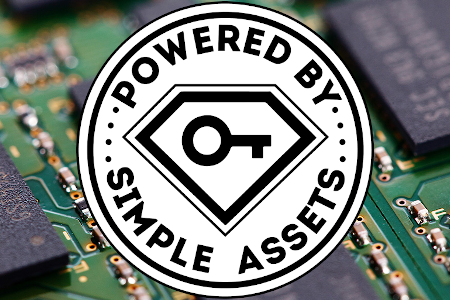

---
title: "SimpleAssets"
description: "SimpleAssets (SA) — 它是 EOSIO 生态系统中数字资产的第一个、简单且强大的标准，允许创建 FT、NTT 和 NFT。"
date: 2022-08-20T00:00:00+08:00
lastmod: 2022-08-20T00:00:00+08:00
draft: false
authors: ["boogArno"]
featuredImage: "simpleassets.png"
tags: ["Other","SimpleAssets"]
categories: ["nfts"]
nfts: ["Other"]
blockchain: ""
website: "https://simpleassets.io"
twitter: "https://twitter.com/EOS_CryptoLions"
discord: ""
telegram: ""
github: "https://github.com/CryptoLions/SimpleAssets"
youtube: "https://www.youtube.com/channel/UCxQkC4oWh4Z6dwzSDrHZlXg"
twitch: ""
facebook: "https://t.me/CryptoLions_io"
instagram: ""
reddit: ""
medium: ""
steam: ""
gitbook: ""
googleplay: ""
appstore: ""
status: "Live"
weight: 
lightgallery: true
toc: true
pinned: false
recommend: false
recommend1: false
---
SimpleAssets (SA) — 它是 EOSIO 生态系统中第一个简单且强大的数字资产标准，允许创建可替代 (FT)、不可转让 (NTT) 和不可替代代币 (NFT)。
适合收藏。非常适合游戏、艺术品、物流、DeFi 等。
真正的所有权。灵活的。内置借贷和容器化。可选的 RAM 付款人。
存在于 TELOS、WAX、EOS、MEETONE、PROTON、EUROPECHAIN。并准备在任何其他 EOSIO 区块链上启动。
由 EOS 区块生产者 CryptoLions 创建。根据 LGPL-2.1 获得许可。开源，免费用于商业用途、修改、分发和私人使用。

