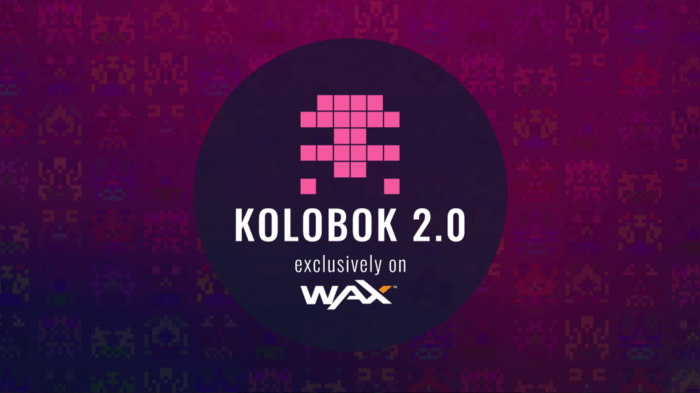

简单资产 FT 和 NFT 的市场。毋庸置疑，即玩即赚 (P2E) 游戏在 WAX 上迅速发展，因此，一些游戏开发者正在大踏步地追随其发展轨迹并探索可能性。 CryptoLions 的 Kolobok Adventures 也不例外。如果你是 WAX 的老手，你可能知道 Kolobok 这个名字——如果你是新手，你会想了解它。第一个在 WAX 上发布的 NFT 游戏正在进行大规模的大修，所以准备好迎接乐趣吧！

