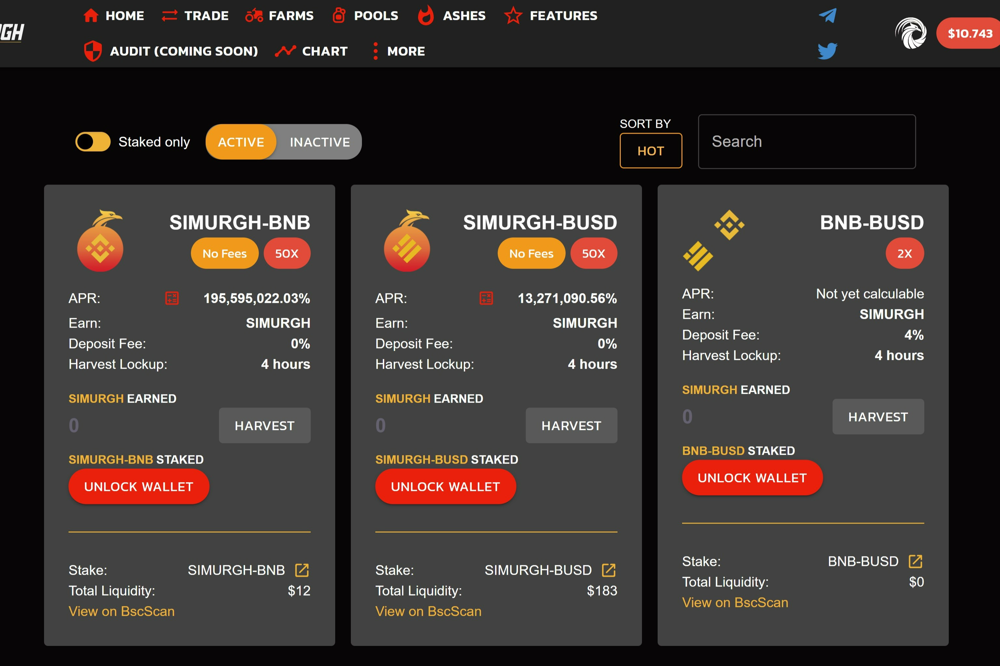

自动燃烧收获锁定反鲸鱼
自动流动性
SIMURGH 的每次转让必须缴纳 5% 的转让税。 4% 的转让税通过合约自动添加到流动性池中，以不断提高价格下限。流动性将被锁定且无法访问。
正如我们上面提到的，SIMURGH 的每次转让都必须缴纳 5% 的转让税。 1% 的转让税将分配给自动流动性获取。剩下的1%的转让税将立即被烧掉。整个过程是自动的。
收获锁定是一种独特的奖励锁定机制，用于限制收获的频率。它旨在防止农业套利机器人不断收获和倾销。
超过总供应量 0.01% 的转账将被拒绝。随着总供应量的增加，这个比例会降低。

没有迁移代码
MasterChef 合约中的迁移代码已被删除。

时间锁
时间锁将在启动后添加。

