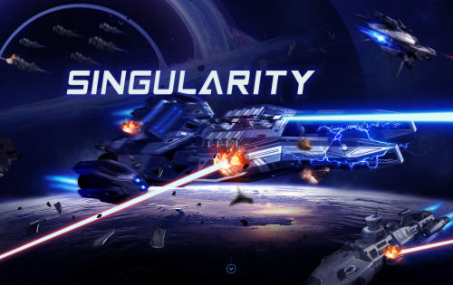

---
title: "Singularity"
description: "Singularity是一款基于宇宙探索和冒险的元宇宙游戏。目前NFT掉落角色为：星系队长。"
date: 2022-08-20T00:00:00+08:00
lastmod: 2022-08-20T00:00:00+08:00
draft: false
authors: ["boogArno"]
featuredImage: "singularity.png"
tags: ["Collectibles","Singularity"]
categories: ["nfts"]
nfts: ["Collectibles"]
blockchain: "BSC"
website: "https://www.singularity.gold/"
twitter: "https://twitter.com/singularitysgly"
discord: ""
telegram: "https://t.me/Singularityverse"
github: "https://github.com/Singularitysgly"
youtube: "https://www.youtube.com/watch?v=XOoChigTVw0"
twitch: ""
facebook: "https://www.facebook.com/profile.php?id=100074305448608"
instagram: ""
reddit: ""
medium: "https://medium.com/@singularitySGLY"
steam: ""
gitbook: ""
googleplay: ""
appstore: ""
status: "Live"
weight: 
lightgallery: true
toc: true
pinned: false
recommend: false
recommend1: false
---
Singularity 是一款基于宇宙探索和冒险的元宇宙游戏。任何玩家都可以通过拥有和发展自己的星座、星系和舰队，以及通过熟练的游戏进行竞争和合作来获得 HME 和 SGLY。他们还可以通过代币和各种 NFT 道具提升实力，在巨大的奇点宇宙中获得满足感和财富，同时在游戏中赚钱。
奇点是一个开放、透明、包容的世界。游戏中的所有信息、资产和游戏内容都可以通过第三方网站轻松访问。
奇点中有多种NFT角色，包括星座大师NFT、星系队长NFT、战舰NFT等。
星系队长：该角色共有20,000枚代币，将陆续开放发售。
奇点游戏第一版预计将于2021年12月上线，游戏内容包括开放军团、战舰编队、战斗系统、战舰养成、排位赛、PE模块、太空税系统等。
SGLY作为奇点游戏中的经济流通代币，计划在BSC发行，SGLY已完成铸币，敬请期待交易所上线（截至11月）。

